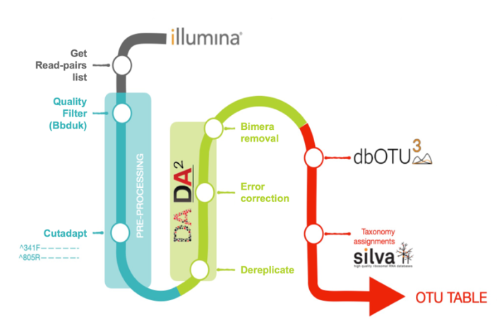

# Snakemake workflow: amplicon analysis

[](https://snakemake.bitbucket.io)
[](https://benjjneb.github.io/dada2/index.html)
[](https://travis-ci.org/snakemake-workflows/amplicon-seq-dada2)



This workflow is an implementation of the dada2 library. I followed the steps in the [Tutorial](https://benjjneb.github.io/dada2/tutorial.html). I use Silva for taxonomic annotation.

## Usage
### Install workflow
To use this workflow, download and extract the [latest release](https://github.com/snakemake-workflows/amplicon-seq-dada2/releases).
#### Dependencies:
The pipeline has some dependencies which can be installed with conda:
```
conda env create -n dada2_env --file env.yml
```
### Configure workflow

Configure the workflow according to your needs via editing the file `config.yaml`.

 You can use the script `prepare_sample_table.py` for it. The scripts searches for fastq(.gz) files inside a folder (structure). If you have paired end files they should have R1/R2 somewhere in the filename. If might be a good idea to simplify sample names.

```
./make_sample_table.py path/to/fastq(.gz)files
```

The script creates a `samples.tsv` in the *working directory*. Here is an example.

| | R1 | R2 |
|- | --- | ---|
| sample1| /path/to/fastqs/sample1/sample1_R1.fastq.gz | /path/to/fastqs/sample1/sample1_R2.fastq.gz |
| sample2 | /path/to/fastqs/sample2_R1.fastq.gz |/path/to/fastqs/sample2_R1.fastq.gz |


### Execute workflow

Test your configuration by performing a dry-run via

    snakemake --configfile path/config.yaml -n

Execute the workflow locally via

    snakemake --configfile path/config.yaml --cores $N
